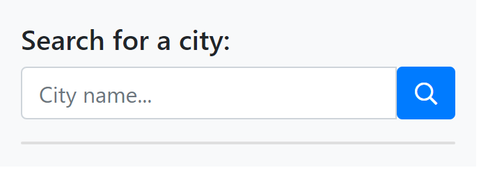
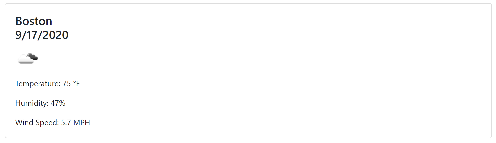
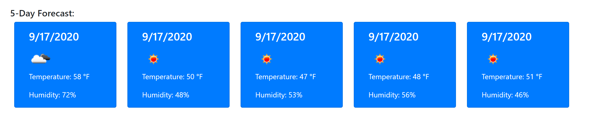
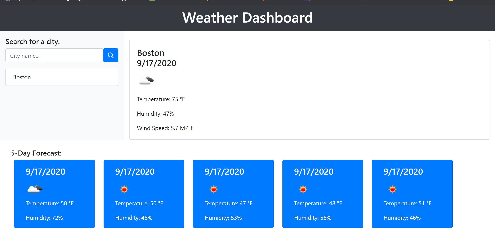

# homework-weather-dashboard

How to use: In the search bar provided on the left side of the page, search a city that you would like to see the weather they currently have and it's five day forecast.

Once that is done and the search button is clicked you will have a pop that provides you the following: 

1) Current Weather:

2) Five day forecast:

The final window will look something like this:

